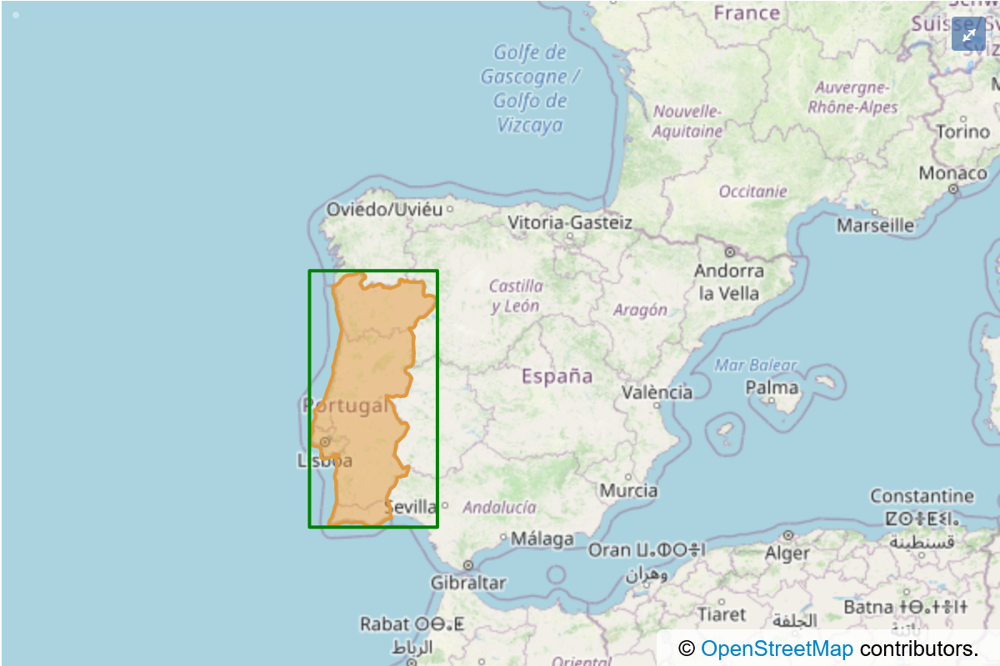
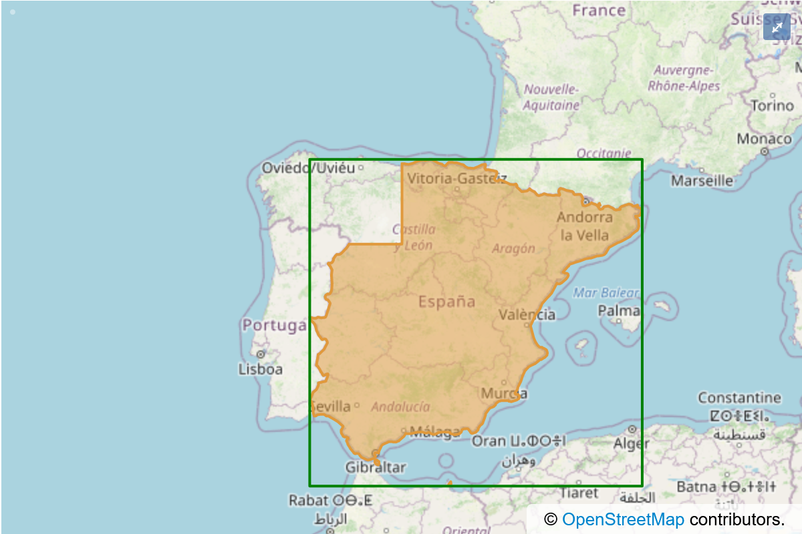
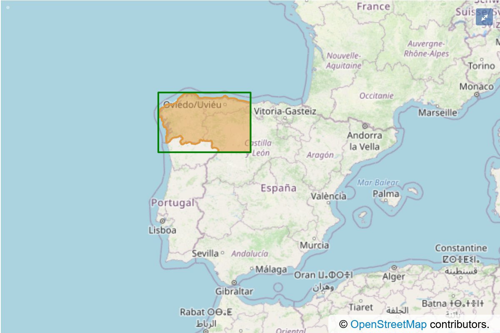

.. _coordinate_conversions_easy:

The easy way
============

When working with the built-in *Coordinate Reference Systems*, PHPCoord can usually convert the
coordinates in any given ``Point`` to be in a different system by calling the ``convert()`` method.

.. code-block:: php

    $newPoint = $point->convert(
        CoordinateReferenceSystem $to,
        bool $ignoreBoundaryRestrictions = false
    ); // returns a new Point

Examples:

.. code-block:: php

    <?php
    use PHPCoord\CoordinateReferenceSystem\Geographic2D;
    use PHPCoord\CoordinateReferenceSystem\Projected;
    use PHPCoord\GeographicPoint;
    use PHPCoord\UnitOfMeasure\Angle\Degree;

    // Converting from NAD83 to Florida State Plane
    $from = GeographicPoint::create(
        Geographic2D::fromSRID(Geographic2D::EPSG_NAD83),
        new Degree(28.46),
        new Degree(-80.53),
        null
    );
    $toCRS = Projected::fromSRID(Projected::EPSG_NAD83_FLORIDA_EAST);
    $to = $from->convert($toCRS); // $to instanceof ProjectedPoint

.. code-block:: php

    <?php
    use PHPCoord\CoordinateReferenceSystem\Geographic2D;
    use PHPCoord\CoordinateReferenceSystem\Projected;
    use PHPCoord\ProjectedPoint;
    use PHPCoord\UnitOfMeasure\Length\Metre;

    // Converting from Florida State Plane to NAD83
    $from = ProjectedPoint::createFromEastingNorthing(
        Projected::fromSRID(Projected::EPSG_NAD83_FLORIDA_EAST)
        new Metre(246029.85),
        new Metre(457274.616)
    );
    $toCRS = Geographic2D::fromSRID(Geographic2D::EPSG_NAD83);
    $to = $from->convert($toCRS); // $to instanceof GeographicPoint

Ignoring the second optional parameter for now, calling ``convert()`` will consult the built-in dataset and if a
conversion is found, then PHPCoord will automatically invoke the relevant conversion method with the appropriate
parameters (see the "hard" section), returning a new ``Point`` object with the adjusted coordinates.

Although PHPCoord has knowledge of thousands of different conversions, this does not cover many scenarios. For example
there is no published direct conversion between a British National Grid reference and a WGS84 UTM Grid reference. In these
scenarios PHPCoord can "chain" conversions it does know about to achieve the desired result, for example it would
automatically calculate British National Grid -> OSGB36 -> WGS84 -> UTM. This ability to chain means conversion
between almost any two CRSs is possible as long as they have a common link.

.. code-block:: php

    $from = ProjectedPoint::createFromEastingNorthing(
        Projected::fromSRID(Projected::EPSG_OSGB36_BRITISH_NATIONAL_GRID),
        new Metre(577275),
        new Metre(69741)
    );
    $toCRS = Projected::fromSRID(Projected::EPSG_WGS_84_UTM_ZONE_31N);
    $to = $from->convert($toCRS);

.. note::

    Calculating every single possible permutation of chain between two CRSs is very computationally expensive
    and so for practicality PHPCoord limits the chain depth to 7 (i.e. the source CRS, 5 intermediate CRSs and
    the target CRS). If you know a transformation should be possible, but PHPCoord cannot find it you may wish
    to try an explicit 2-stage conversion (e.g. source to WGS84, WGS84 to target).

Boundaries
----------
Every CRS has a defined area ("extent") over which it operates. Some are worldwide (e.g. WGS84), but most are regional
(e.g. NAD83) or country-specific (e.g. GDA94). When converting points between different coordinate systems, it's
important that these extents are respected, as any conversion formulas are only valid within the specified area of
operation. For instance taking a point located in Tokyo and trying to obtain the New Zealand Map Grid coordinate for it
is a nonsensical operation - theoretically you could find a chain of conversions (e.g. perhaps through WGS84) that would
would produce *a* coordinate, but it would not be in the expected spot when plotting it onto an actual map.

PHPCoord will not normally allow such conversions to take place.

There are occasions however where the formal definitions of the CRS and real-life conflict - for example in Germany
(which is partially in UTM zone 32 and partially in zone 33), coordinates are sometimes requested as zone 32-based
even for points that are in zone 33. The administrative convenience is considered to outweigh the slight loss of
accuracy of extending the zone.

If you are sure that you know what you're doing, you can set the optional parameter ``$ignoreBoundaryRestrictions``
to ``true`` to remove these boundary checks. Conversions between coordinate systems located in different regions
(e.g. USA to UK, or Japan to NZ) will still be disallowed.

.. note::
    For more on how PHPCoord implements boundaries/extents, :ref:`see below<accuracy>`.

.. caution::
    The importance of boundary checking to ensure fidelity of results means that converting a standalone
    ``VerticalPoint`` cannot safely be done. ``VerticalPoint`` objects therefore do not have a ``->convert`` method.

    In practice this should not affect you as a ``VerticalPoint`` will normally be used as part of a ``CompoundPoint``.

Universal Transverse Mercator (UTM)
-----------------------------------
PHPCoord has 3 different ways of handling UTM references (:ref:`see here for details<utm_points>`).

For conversions that *do not* involve a ``UTMPoint``, use the ``->convert()`` method as described above.

For conversions from a ``GeographicPoint`` to a ``UTMPoint``, call the ``->asUTMPoint()`` method.

.. code-block:: php

    $from = GeographicPoint::create(
        Geographic2D::fromSRID(Geographic2D::EPSG_WGS_84),
        new Degree(43.642567),
        new Degree(-79.387139),
        null
    );
    $to = $from->asUTMPoint();

.. note::
    You cannot directly convert to a ``UTMPoint`` from a different kind of ``ProjectedPoint`` or a ``GeocentricPoint``,
    you must convert to the relevant ``GeographicPoint`` first. This is because the projection parameters are calculated
    dynamically at runtime and are not available to take part in chain creation.

For conversions from a ``UTMPoint`` back to the associated ``GeographicPoint``, call the ``->asGeographicPoint()`` method.

.. code-block:: php

    $from = new UTMPoint(
        new Metre(630084),
        new Metre(4833439),
        17,
        UTMPoint::HEMISPHERE_NORTH,
        Geographic2D::fromSRID(Geographic2D::EPSG_WGS_84)
    );
    $to = $from->asGeographicPoint();

The ``->convert()`` method *is* present on ``UTMPoint``\s and can be used as normal to convert to any desired CRS
(including the base CRS).

.. _accuracy:

Accuracy
--------
If the Earth were actually the shape of an ellipsoid, algorithms could be devised so that conversions between systems
could be performed with no absolutely no loss of accuracy - systems would in effect be mathematically equivalent.

Unfortunately the Earth isn't an ellipsoid and coordinates are determined by individual humans
operating on the Earth's actual, irregular surface using instruments subject to observation error. That means
that conversions between CRSs are not just converting between mathematical ideals but often convert between
*sets of observations*. When this happens it means that the conversions between the CRSs can only ever be
an approximation (typically within a few metres) rather than exact.

Extents
^^^^^^^
When dealing with CRSs that cover significant land area it is possible (and common) for mapping agencies to derive
multiple different parameter sets for use to obtain better accuracy depending on location. For example when converting
from ED50 to ETRS89 different parameters should be used for a point inside France than a point inside Denmark.

In order to be able to do conversions successfully, PHPCoord therefore needs to know not just the geographical extents
of each coordinate system but also (where different), the geographical extents of each possible set of conversion
parameters.

For a closer look at this, keeping the same example of ED50 to ETRS89, let's consider the far-west of Europe
(Spain and Portugal). Here, the relevant authorities have produced three distinct conversions, each for a different area.
They are shown below in orange:

Even after deduplication, there are over 3000 distinct geographic extents required to support the full range of
PHPCoord's conversion abilities. Because borders are rarely straight lines, the full set of extent data for each and
every coordinate system supported by PHPCoord would be over 100Mb of polygon data. That is far, far too much data to ask
each and every library user to download and incorporate into their application.

Grids
^^^^^
For more modern coordinate systems it is becoming standard for mapping agencies to go beyond simply providing tailored
parameters for broad regions or states within their territory and to provide detailed adjustments using a grid.
For instance in New Zealand a 20km×20km grid provided by LINZ can be used to make significantly more precise conversions
between NZGD1949 and NZGD2000. Using the grid provides for typical accuracy of ±0.2m, compared to a 4m accuracy from the
alternative published transformation. For obvious reasons these grid files can also be quite large, and therefore the same
concerns about packaging them apply.

"Out of the box"
^^^^^^^^^^^^^^^^
The core PHPCoord package attempts to strike a pragmatic balance between accuracy and download size. It does not provide
access to any grid-based corrections, and it uses simple bounding boxes (the green lines) as extent data rather than the
detailed orange polygons.

As is obvious from looking at the Spain/Portugal images though, the areas enclosed by the green boxes have areas
of overlap. In fact there are areas of north-east Portugal that are actually encompassed by all 3! If a coordinate
is located within one of these overlap areas, then each of those 3 possible conversions is necessarily considered
equally valid, and which one is ultimately utilised is undefined. The difference in resulting coordinate from any use
of the "wrong" formula is likely to be very small (perhaps a few metres).

.. note::
    This particular example was European, but "wrong" conversions can be picked wherever there are multiple extents for
    a given pair of coordinate systems. For example NAD27/83 conversions in North America, or SAD69 conversions in South
    America can be similarly affected.

Add-on datapacks
^^^^^^^^^^^^^^^^
Not every user will consider the above tradeoff to be desirable, preferring instead to have the highest-accuracy
conversions possible even at the cost of increased disk space.

PHPCoord supports this mode of operation via the use of optional add-on "datapacks". These are additional Composer
packages (8 available), each corresponding to a different region of the world:

* ``php-coord/datapack-africa``
* ``php-coord/datapack-antarctic``
* ``php-coord/datapack-arctic``
* ``php-coord/datapack-asia``
* ``php-coord/datapack-europe``
* ``php-coord/datapack-northamerica``
* ``php-coord/datapack-oceania``
* ``php-coord/datapack-southamerica``

Installing them provides access to the full-fidelity polygons for the relevant area of the world (at a scale of approx
1:15000000) and also any applicable grid files allowing PHPCoord to do the best possible job.

No configuration is necessary once installed.
